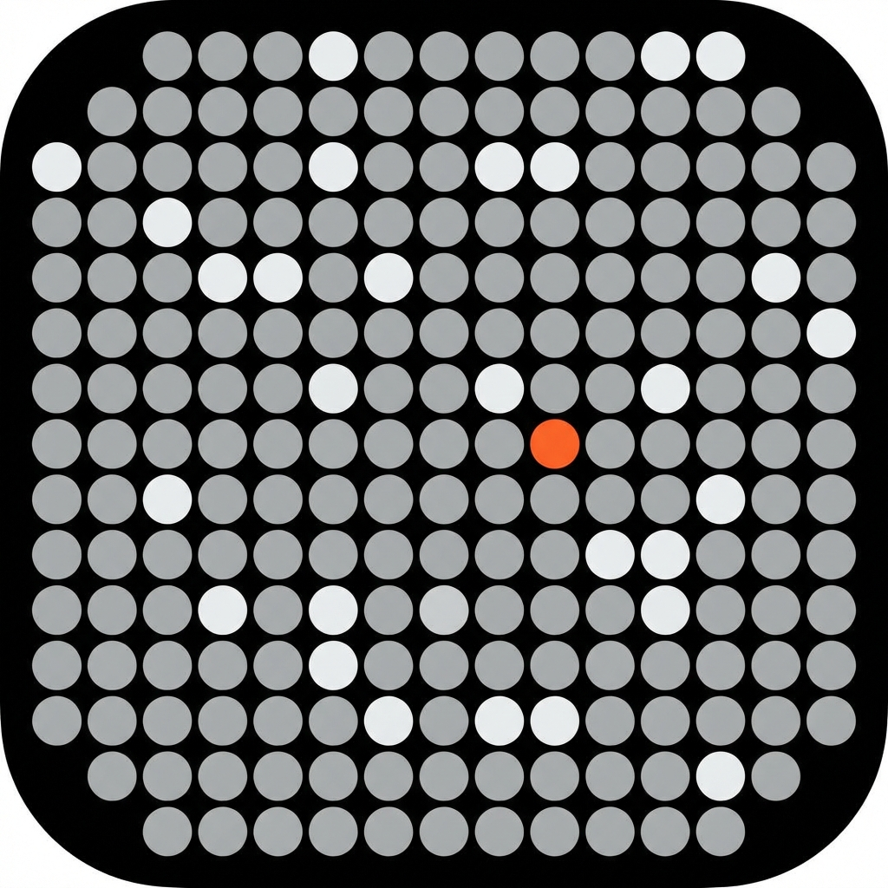

# Year in Dots 📅

**Visualizing the year, one dot at a time.**

A minimalist "Life Calendar" for your browser's New Tab page. It displays the 365 days of the year as a grid of dots:
*   ⚪ **Past days** are completed.
*   🟠 **Today** is highlighted (orange, blinking, or hourglass).
*   ⚫ **Future days** are waiting to be lived.

## ✨ Features

*   **Live Progress**: See exactly how much of the year has passed (e.g., "54% Completed").
*   **Customizable "Today"**: Choose between a static Orange Dot, Blinking Red, or a Spinning Hourglass.
*   **Zero Distractions**: Clean, dark-mode design to keep you focused.
*   **Local Privacy**: All settings are saved directly in your browser.

## 🚀 Usage

### Option 1: Chrome Extension (Recommended)
1.  Clone or download this repository.
2.  Open Chrome and go to `chrome://extensions`.
3.  Enable **Developer mode** (top right).
4.  Click **Load unpacked** and select this folder.
5.  Open a new tab to see it in action!

### Option 2: Web Version
You can check out the live web demo here:
[**Live Demo**](https://year-in-dots.vercel.app/) *(Replace this link after you deploy!)*

## 🛠️ Development

To customize the design:
*   `index.html`: The main structure.
*   `style.css`: Colors, grid layout, and animations.
*   `script.js`: Logic for calculating days and rendering dots.

## 📄 License

This project is open source and available under the [MIT License](LICENSE).
